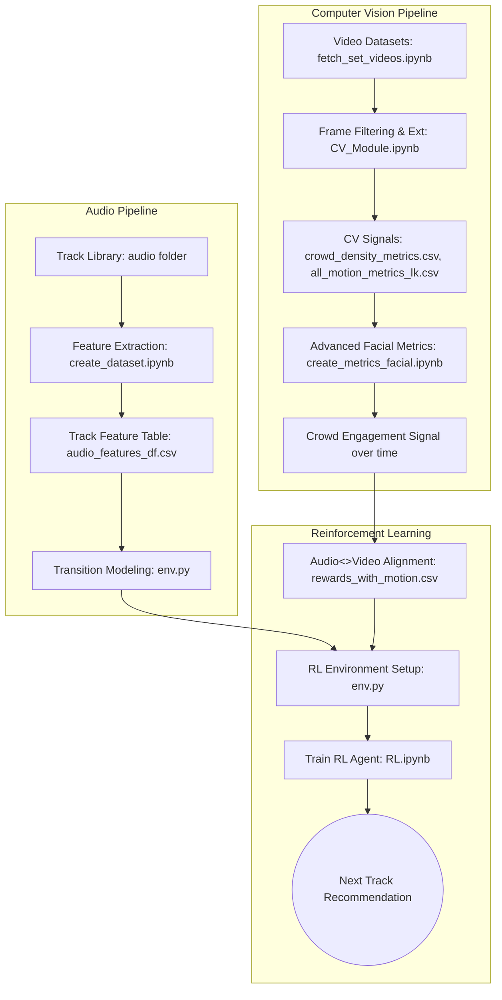

# RL-Guided DJ Track Recommendation System 

Welcome to the **CentraleSupélec Computer Vision & Reinforcement Learning Project**. 

This project explores a unique intersection of **Computer Vision (CV)** and **Reinforcement Learning (RL)**: training an autonomous DJ recommendation agent that observes a live crowd and selects the next song to maximize crowd engagement.

## Problem Definition

**Given the current physical state of the crowd and the audio state of the current song, the system selects the best next track (or "music vibe") to maximize crowd engagement while maintaining a musically smooth transition.**

We achieve this without relying on heavy Deep Learning models. Instead, we use highly efficient, mathematically rigorous **Classical Computer Vision** techniques to extract engagement signals from massive Boiler Room video datasets locally on CPU. 

---

## System Pipeline Architecture

The project is split into three core modules: Perception (CV), Representation (Audio), and Decision-Making (RL).

### Phase 1: Perception (Computer Vision Module)
Instead of deep neural networks, we engineered a lightweight, multi-modal classical CV pipeline to extract crowd signals frame-by-frame:

1. **Camera Angle Filtering (Canny Edge Detection):**
   - *Problem:* Boiler Room videos heavily pan the camera away from the crowd.
   - *Solution:* We isolate the bottom half of the frame and apply a Canny Edge Detector. Frames with a high density of sharp geometric lines (DJ mixers, laptops, CDJs) are flagged as correct angles. Other frames are dropped.
2. **Motion Energy (Lucas-Kanade Optical Flow):**
   - We extract Shi-Tomasi corners and track them frame-to-frame using Lucas-Kanade sparse optical flow. The average Euclidean distance of these tracked points serves as our raw "Crowd Hype / Motion" metric.
3. **Crowd Density (Sobel Filters):**
   - We calculate edge intensity gradients using Sobel filters. Higher gradient sums indicate a denser, more packed crowd.
4. **Human Presence (Viola-Jones Face Detection):**
   - We utilize Haar Cascades to count visible, forward-facing faces, acting as a secondary proxy for active crowd engagement.

### Phase 2: Audio Analysis
We represent songs as quantifiable features rather than just raw audio.
- Extract properties such as **BPM, Energy, and Spectral Features** (using `librosa` or `Essentia`).
- Build a transition matrix to calculate the musical cost (ΔBPM, ΔEnergy) of jumping from one song to another.

### Phase 3: Reinforcement Learning (Decision-Making Module)
This is where the magic happens. We synchronize the video timestamps (CV metrics) with the DJ's tracklist timestamps.
- **State:** Current Track Features (BPM, Energy) + Current Crowd Engagement (Motion, Density).
- **Action:** Select the next track from the library.
- **Reward:** The CV-derived crowd engagement signal during the selected track, heavily penalized by "unsmooth" musical transitions.
- **Agent:** The model explores the state-action space and learns an optimal policy for keeping the crowd moving.

---

## 🗺️ Project Flowchart

## 🛠️ Tech Stack
*   **Computer Vision:** `OpenCV`, `NumPy`
*   **Data Processing:** `Pandas`, `Matplotlib`
*   **Decision Making:** Standard feature selection for the CV module and Python RL implementations